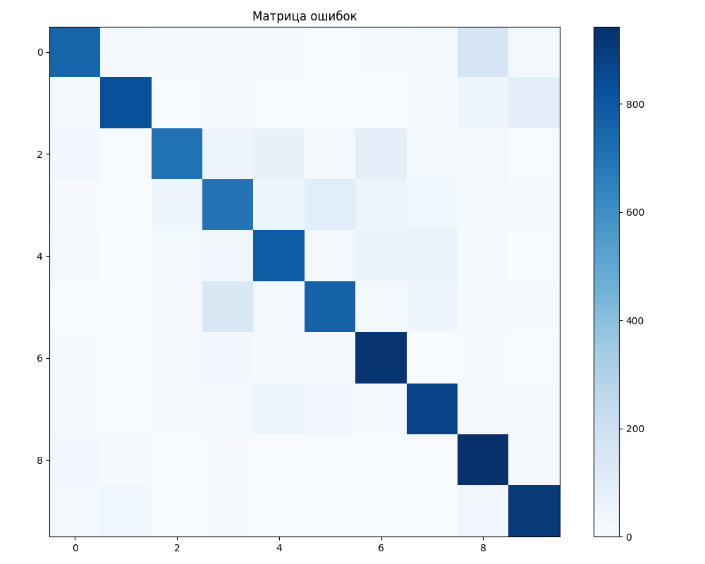

# Лабораторная работа №2: Распознавание изображений с помощью Transfer Learning

Этот проект демонстрирует решение задачи классификации изображений с использованием техники **Transfer Learning** (переноса обучения). В качестве основы используется предобученная сверточная нейронная сеть **ResNet50**.

## Описание Задачи и Решения

**Задача:** Классифицировать изображения из датасета CIFAR-10 (10 классов) с использованием сверточной нейронной сети.

**Решение:**
1.  **Предобученная модель:** Вместо обучения глубокой сети с нуля, мы берем модель `ResNet50`, уже обученную на огромном датасете ImageNet. Эта модель уже умеет выделять общие признаки изображений (границы, текстуры, формы).
2.  **Заморозка весов:** Все слои базовой модели ResNet50 "замораживаются", чтобы их веса не менялись в процессе обучения. Это сохраняет накопленные ими "знания".
3.  **Новый классификатор:** Последний полносвязный слой (`fc`) модели, который изначально был предназначен для 1000 классов ImageNet, заменяется на новый. Этот новый "хвост" модели состоит из нескольких слоев и адаптирован под нашу задачу — классификацию на 10 классов.
4.  **Обучение:** Обучаются **только** веса нового классификатора. Это значительно быстрее и требует меньше данных, чем обучение всей сети с нуля.
5.  **Датасет:** Используется стандартный датасет CIFAR-10, который автоматически загружается скриптом.

## Структура и Технологии

- **Фреймворк:** PyTorch
- **Архитектура:** ResNet50
- **Техника:** Transfer Learning
- **Оптимизатор:** Adam
- **Функция потерь:** CrossEntropyLoss

## Метрики Качества

Для оценки качества модели используются стандартные для задач классификации метрики:
- **`classification_report`**: Расчет `precision`, `recall`, `f1-score` для каждого класса.
- **`confusion_matrix` (Матрица ошибок)**: Визуализация того, какие классы модель путает между собой.
- **`Accuracy` (Точность)**: Общий процент правильных предсказаний.

## Результаты и выводы

### Консольный вывод

```text
Начало процесса оценки модели...
Тестирование: 100% 313/313 [00:32<00:00,  9.60it/s]

Отчет о классификации:
              precision    recall  f1-score   support

           0       0.87      0.75      0.81      1000
           1       0.92      0.83      0.87      1000
           2       0.86      0.71      0.77      1000
           3       0.71      0.70      0.71      1000
           4       0.80      0.78      0.79      1000
           5       0.82      0.76      0.79      1000
           6       0.79      0.92      0.85      1000
           7       0.82      0.87      0.85      1000
           8       0.76      0.94      0.84      1000
           9       0.85      0.90      0.88      1000

    accuracy                           0.82     10000
   macro avg       0.82      0.82      0.82     10000
weighted avg       0.82      0.82      0.82     10000


Матрица ошибок сохранена в файл 'confusion_matrix.png'

Программа завершена успешно!
```

### Матрица ошибок



### Анализ результатов

Модель, обученная с помощью Transfer Learning, показала **очень хороший результат**, достигнув итоговой точности **82%** на 10 000 тестовых изображений.

- **Матрица ошибок** имеет ярко выраженную диагональ, что говорит о том, что большинство предсказаний верны. Светлые квадраты вне диагонали показывают, какие классы модель иногда путала между собой (например, классы 2, 3 и 5).
- **Отчет о классификации** подтверждает высокую эффективность модели. Большинство классов имеют `precision` и `recall` выше 0.80. Самый сложный для модели класс, судя по метрикам, — класс 3 (`f1-score` = 0.71), а самые простые — классы 1 и 9.
- **Процесс обучения** был стабильным: ошибка на валидационной выборке (`Val Loss`) планомерно снижалась, что говорит об отсутствии переобучения.

Использование GPU (CUDA) позволило сократить время обучения одной эпохи до ~3.5 минут, что демонстрирует колоссальную эффективность аппаратного ускорения для задач глубокого обучения.

## Как запустить

1.  Установить зависимости:
    ```bash
    pip install -r requirements.txt
    ```
2.  Запустить скрипт:
    ```bash
    python transfer_learning.py
    ```
Скрипт автоматически загрузит датасет CIFAR-10 в папку `data/` и начнет процесс обучения. По окончании будет выведен отчет и сохранено изображение с матрицей ошибок `confusion_matrix.png`. 